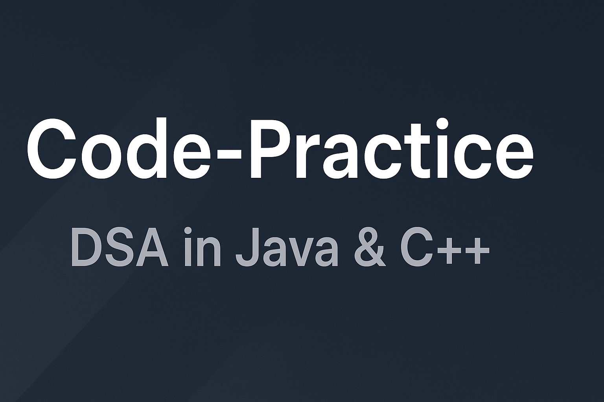

<!-- Banner Image -->

  

# 🧠 Code-Practice

> 🚀 A personal repository to practice **Data Structures & Algorithms** in **Java** and **C++**.  
> Organized by problem, cleanly structured, and ideal for interview prep and revision.

---

## 📊 GitHub Repository Stats

---

## 🧩 About the Project

This repository contains my solutions to various **coding challenges and algorithmic problems**, implemented in **Java** and **C++**.  
Each problem has its own directory, following a clear and consistent naming pattern for easy navigation.

### 🎯 Goals
- Strengthen problem-solving skills  
- Practice DSA for competitive programming  
- Maintain clean and modular code  
- Serve as a reference hub for future revision  

---

## 📁 Repository Structure

A glimpse of the folder organization:

Code-Practice/

      │
      ├── 1-two-sum/
      │ ├── TwoSum.java
      │ └── TwoSum.cpp
      │
      ├── 11-container-with-most-water/
      │ ├── ContainerWithMostWater.java
      │ └── ContainerWithMostWater.cpp
      │
      ├── 1013-fibonacci-number/
      │ ├── FibonacciNumber.java
      │ └── FibonacciNumber.cpp
      │
      └── ...

🧱 **Folder Naming Convention:**

- Each folder starts with a problem number or ID  
- Contains implementations in one or both languages (Java/C++)  

---

## 🧮 Languages Used

| Language | % Usage | Description |
|-----------|----------|-------------|
| 🟦 **Java** | ~65% | Primary language for solving algorithmic problems |
| 🟩 **C++** | ~35% | Secondary implementation for speed and low-level understanding |

---

## ⚙️ How to Use

    1. **Clone the Repository**
       
       git clone https://github.com/Shivanshu48/Code-Practice.git
       cd Code-Practice
       Navigate to a Problem Folder

    2. cd 1-two-sum
       Run the Code

**For Java**

    javac TwoSum.java
    java TwoSum

**For C++**

    g++ -std=c++17 TwoSum.cpp -o TwoSum
    ./TwoSum
    
## Add Your Own Solutions--

    Create a new folder (e.g., 123-new-problem/)
    
    Add your .java or .cpp files

Follow consistent naming and structure

🌐 Connect with Me
Let’s connect and grow together 🚀
| Platform | Link |
|-----------|------|
| 💻 **GitHub** | [@Shivanshu48](https://github.com/Shivanshu48) |
| 💼 **LinkedIn** | [linkedin.com/in/shivanshu48](https://linkedin.com/in/shivanshu48) |
| ✉️ **Email** | [Send Email](shivanshupandey048@gmail.com) |

## 🤝 Contributing

**Contributions are always welcome!**

If you’d like to contribute:

    1.. Fork the repo
    
    2.. Create a new branch (feature/your-feature-name)
    
    3.. Commit your changes
    
    4.. Push and open a Pull Request 🎉

## Make sure your code is clean, commented, and tested before submitting.

⭐ If you find this repo helpful, don’t forget to star it! ⭐
